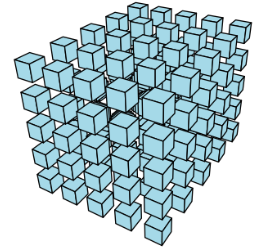
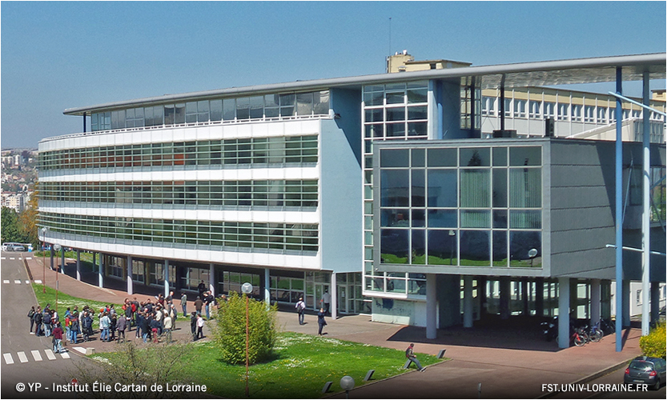

## Journée scientifique du pôle AM2I : "Introduction à la géométrie des tenseurs" (Monday 3rd November 2025)

**Location**: IECL (Institut Élie Cartan de Lorraine), Université de Lorraine, rue du Jardin botanique, Villers-lès-Nancy (salle de conférences).  [How to get there](https://www.openstreetmap.org/?#map=19/48.665865/6.159937)

**Date**: November 3rd, 2025.

## About the Workshop
This one-day workshop is an introduction to the mathematical theory of tensors, specifically from the viewpoints of algebraic geometry and commutative algebra, and its applications. 
This topic has indeed been attracting considerable research interest in the past few years, due to its various applications, for example in machine learning, algebraic statistics as well as signal processing. 

Though it is intended to non-specialists geometers, part of the talks will be accessible to a larger audience, and everyone is welcome!

## Registration
Registration is free but mandatory (the capacity is limited), by October 15th at the latest.
You can register [here](https://enquetes.univ-lorraine.fr/index.php/417547?lang=fr).

## Invited speakers
- [Bernard Mourrain](https://www-sop.inria.fr/members/Bernard.Mourrain/) (INRIA Sophia-Antipolis)
- [Pierpaola Santarsiero](https://pierpaolasantarsiero.wixsite.com/pierpaola) (Università Politecnica delle Marche, Ancona, Italy)
- [Luca Sodomaco](https://sites.google.com/view/luca-sodomaco/home) (Max-Planck-Institut, Leipzig, Germany)
- [Alexander Taveira Blomenhofer](https://a44l.github.io/) (QMATH centre, University of Copenhagen, Denmark)
- [Nick Vannieuwenhoven](https://people.cs.kuleuven.be/~nick.vannieuwenhoven/) (KU Leuven, Belgium)

## Schedule (to be confirmed)

| **Time**         | **Session**                             |
|-----------------------|-----------------------------------------|
| 10:00-10:30      | Welcome coffee                        |
| 10:30-11:30      | Nick Vannieuwenhoven   *An introduction to tensor rank decomposition*  [(abstract)](#nick-vannieuwenhoven)  [(slides)](Nancy20251027.pdf)|
| 11:30-12:15      | Alexander Taveira Blomenhofer   *Additive X-rank decomposition* [(abstract)](#alexander-taveira-blomenhofer)  [(slides)](2025-11-ablomenhofer-nancy.pdf)            |
| 12:15-14:00      | Lunch break          |
| 14:00-15:00      | Bernard Mourrain    *An algebraic-geometric view on tensor decomposition problems* [(abstract)](#bernard-mourrain) [(slides)](25.Tensors-Nancy.pdf) |                      
| 15:00-15:45     | Pierpaola Santarsiero   *Terracini-inspired insights for tensor decomposition* [(abstract)](#pierpaola-santarsiero) [(slides)](pierpaola_talk.pdf)  |
| 15:45-16:15      | Coffee break                               |
| 16:15-17:00      | Luca Sodomaco   *Nonlinear Rayleigh quotient optimization*      [(abstract)](#luca-sodomaco) [(slides)](Slides_Nancy_Sodomaco.pdf)     |
| 19:30            | Dinner at Grand Café Foy |

### Nick Vannieuwenhoven
*An introduction to tensor rank decomposition*

**Abstract:** The tensor rank decomposition is a fundamental tensor decomposition with applications spanning signal processing, data analysis, and machine learning. This talk will provide an accessible introduction to tensors and their basic properties. We investigate the algebraic geometry of the set of bounded-rank tensors. A geometric perspective on identifiability will be presented, including a flavor of the conditions under which uniqueness of tensor rank decompositions can be guaranteed. Finally, we consider metric questions and determine the sensitivity of tensor rank decomposition to perturbations of the tensor.

[(back to schedule)](#mon)

### Alexander Taveira Blomenhofer
*Additive X-rank decomposition*

**Abstract:** The X-rank problem aims to write a vector as a sum of r elements of a subvariety X, where r is minimal. Common examples include tensor rank, symmetric tensor rank, Chow rank and alternating rank, where X is, respectively, the Segre variety, the Veronese variety, the Chow variety or the Grassmannian. The X-rank problem also occurs in the parameter estimation problem for Gaussian mixtures from moments. We discuss recent results on X-rank, such as identifiability and algorithms. Based on joint work with Benjamin Lovitz and Alex Casarotti. 

[(back to schedule)](#mon)

### Bernard Mourrain
*An algebraic-geometric view on tensor decomposition problems*

**Abstract:** Tensors are fundamental mathematical objects that generalize matrices to higher dimensions and play a crucial role in various domains. 

Tensor decomposition has emerged as a key technique in the analysis of higher-order tensors, to reveal the underlying structure of the data, 
to reduce its complexity, and to facilitate more efficient computations. However, it is a challenging problem from a computational and numerical point of view.
This can be explained by the complex and still unrevealed geometry hidden behind the scene.

We will explore this geometry through the prism of algebra, illustrating how Artinian algebras can be naturally associated with general tensor decompositions for multilinear, symmetric, and multisymmetric tensors. 

We will review algebraic geometric approaches, which reduces tensor decomposition to direct eigenvalue and eigenvector computations when the rank is small.

When the rank is higher, the geometry is much more complex. We will see how the tensor decomposition problem can be transformed into a simultaneous diagonalization problem of extended tensors. The relationship between these varieties of extended tensors and the punctual Hilbert scheme, via families of commuting matrices will be discussed.

The various concepts will be illustrated by effective calculations on a few examples.

[(back to schedule)](#mon)
 
### Pierpaola Santarsiero
*Terracini-inspired insights for tensor decomposition*

**Abstract:** In this talk, I will revisit Terracini’s Lemma from a geometric perspective, exploring its connections with tensor decomposition. By examining these links, we gain inspiration to study the r-Terracini locus of a variety X. This is the locus of all sets of r smooth points of X whose span of the corresponding tangent spaces has dimension less than expected. Time permitting, I will also touch upon Terracini’s second lemma and the directions it suggests for further exploration.

[(back to schedule)](#mon)

### Luca Sodomaco
*Nonlinear Rayleigh quotient optimization*

**Abstract:** The nonzero critical points of the Rayleigh quotient associated with a square matrix correspond to its nonzero eigenvectors. In this work, we study the critical points of the Rayleigh quotient constrained to an algebraic variety. We relate the number of complex critical points to the Euclidean distance degree of a Veronese embedding of the variety of constraints and provide concrete formulas in various scenarios, including those involving varieties of rank-one tensors. This presentation is about joint work with Flavio Salizzoni and Julian Weigert.

[(back to schedule)](#mon)

## Organizers
### Funded by
 - pôle AM2I, Université de Lorraine
 - équipe géométrie, IECL
 - CNRS IEA project AT-AI (CRAN)

### Administrative support
 - Mathilde Bleeker
 - Anne Incerti
 - Paola Schneider

### Organizing committee 
 - Clara Derand
 - Gianluca Pacienza
 - Konstantin Usevich
 - [Institut Élie Cartan de Lorraine](https://iecl.univ-lorraine.fr/) 
 - group [SiMul @ CRAN](https://cran-simul.github.io/).

### Contact Us

You can email the organizers at: [firstname.lastname@univ-lorraine.fr](firstname.lastname@univ-lorraine.fr)

<table width="100%" cellspacing="0" cellpadding="0" border="0" style="border-collapse: collapse; border: none;">
  <tr>
    <td align="center" width="25%">
      
    </td>
    <td align="center" width="25%">
      
    </td>
    <td align="center" width="25%">
      
    </td>
    <td align="center" width="25%">
      
    </td>
  </tr>
</table>

---

&copy; 2025 Journée scientifique du pôle AM2I : "Introduction à la géométrie des tenseurs"
